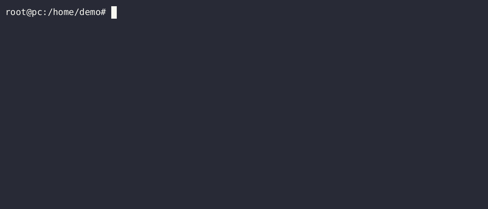

# onmcli

"Okda Network Manager CLI" (onmcli) is a command-line interface designed 
for configuring the Sysrepo datastore. 
It operates by generating commands based on the YANG modules
that have been installed in the Sysrepo system.

## Table of Contents

- [Build](#Build)
- [Usage](#usage)
- [Contributing](#contributing)
- [License](#license)

## Build
require: [sysrepo](https://github.com/sysrepo/sysrepo).

`onmcli` uses a customized fork of [libcli](https://github.com/dparrish/libcli).

```bash
# build
$ make
# run
$ ./onmcli
```

The default compiler is gcc. It can be changed to clang using:
```bash
# build
$ CC=clang make
# run
$ ./onmcli
```

## usage

[+] demo



[+] you can manage sysrepo:
```commandline
pc# sysrepo ?
  set-module-path      set yang modules path search to install in sysrepo
  list-modules         list all sysrepo yang modules
  load-modules         load all yang modules from sysrepo and generate the cmds.
  install-module       install yang module in sysrepo
  remove-module        remove yang module from sysrepo
pc# sysrepo set-module-path /path/to/yang/standard/ietf/RFC
pc# sysrepo install-module ietf-vrrp.yang
[INF] Module "ietf-vrrp" was installed.
[INF] File "ietf-vrrp@2018-03-13.yang" was installed.
pc# sysrepo list-modules
[+] ietf-ipv4-unicast-routing
[+] ietf-routing
[+] ietf-vrrp
pc#
```
